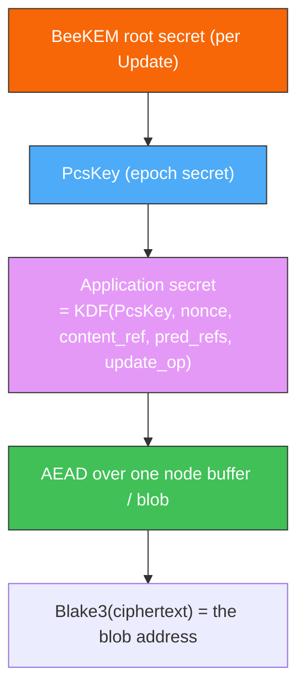
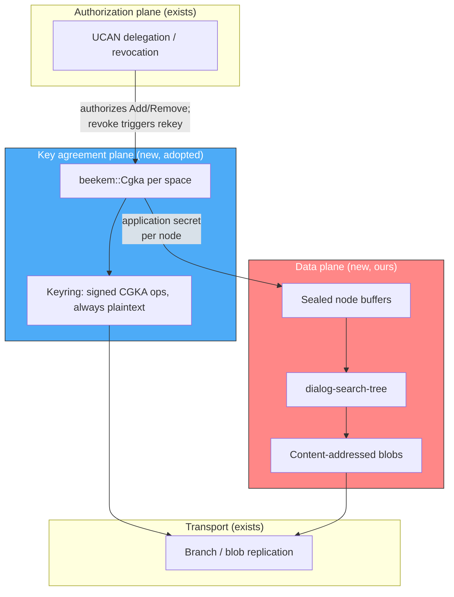
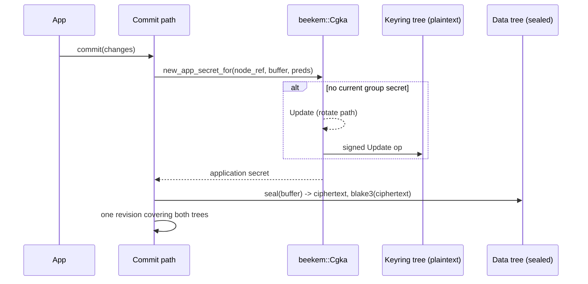

# BeeKEM in Dialog

A review of [BeeKEM] ([paper], [`beekem` crate]) against what Dialog already
has, and a proposal for how to get group key agreement into Dialog without
rebuilding the half of it we have already built.

[BeeKEM]: https://www.inkandswitch.com/keyhive/notebook/02/
[paper]: https://eprint.iacr.org/2026/1434.pdf
[`beekem` crate]: https://docs.rs/beekem/latest/beekem/

## The short version

BeeKEM answers exactly one question: *what symmetric key does the group use
right now, and how does that key change as members come and go?* It is a
decentralized continuous group key agreement (DCGKA) protocol — TreeKEM
adapted so that concurrent operations merge instead of requiring a central
service to serialize them.

It is deliberately **not** an authorization system, **not** a sync protocol,
**not** a PKI, and **not** a content encryption scheme. In Keyhive those are
separate components (convergent capabilities, Beelay, prekeys, per-chunk
application secrets) and BeeKEM is the small cryptographic core in the middle.
Dialog already has three of those four. That is what makes adoption tractable
and it is also where the overlap has to be managed carefully: we want
Keyhive's BeeKEM, not Keyhive's capability model, which competes head-on with
`dialog-capability`.

The recommendation, in one line: **depend on the `beekem` crate, drive it from
the revision DAG we already have, and spend our own effort on the content
encryption layer, which is the part nobody can hand us.**

And build that encryption layer *first*, against a static key — see
[Suggested sequence](#suggested-sequence). It is the invasive, format-defining
half, it is useful on its own, and BeeKEM slots into a one-function seam
behind it.

## What BeeKEM actually is

### The tree

A perfect binary tree over member slots. Each leaf is a member (`id`, X25519
public key) or empty or a tombstone. Each inner node holds one or more
*versions*: a public key plus ciphertexts of the matching secret key.

The whole protocol rests on one invariant:

> **Invariant 1.** Access to the private key of a node `v` is sufficient to
> decrypt the encrypted private key of any node `u` on the direct path of `v`.

So any member walks leaf → root, decrypting as they go, and lands on the group
secret at the root. A node's secret is encrypted under a key derived by
Diffie-Hellman between the two children, so either child's holder can recover
it — that is the trick that makes an update cost `O(log n)` ciphertexts rather
than `O(n)`.

Four operations, all of them "edit a leaf and then edit every node up to the
root":

| Operation | Effect | Group secret after |
| --- | --- | --- |
| `Create` | two-level tree, caller in leaf 0 | undefined |
| `Add` | claim an empty leaf for the new member, **blank** every ancestor | undefined |
| `Remove` | blank the leaf (leaving a tombstone) and every ancestor | undefined |
| `Update` | fresh key pair per level along the direct path, re-encrypted for each sibling | **defined** |

Only `Update` defines a group secret. Membership changes destroy it and the
next update re-establishes it. That is a feature: it means "who is in the
group" and "what key does the group hold" are never in disagreement.

### The concurrency story

This is the part that distinguishes BeeKEM from TreeKEM and the part that
matters most to Dialog, because Dialog is a local-first database where
concurrent writes are the normal case, not an exception.

- Operations form a **hash DAG** (`G`), each op naming its predecessors.
- Materialization is a deterministic function from op set to tree: topologically
  sort, apply sequential ops one by one, apply concurrent *batches* specially.
- Concurrent updates to the same node produce a **conflict node** that keeps
  *all* versions rather than picking a winner.
- The **resolution** of a blank or conflict node is the set of its highest
  non-blank, non-conflict descendants. An update encrypts its new secret
  separately for every node in the sibling's resolution — this is where the
  `O(log n)` degrades toward `O(n)`, in proportion to how many members updated
  while partitioned.
- Merge rules: remove-wins over concurrent add; members added in a batch are
  removed and reinserted in a deterministic (e.g. lexicographic) order, because
  two branches may have handed the same leaf to different people; and no group
  secret is defined by a merge.

The four properties the materialization function guarantees — strong
convergence, remove liveness, add liveness under remove-wins, no secret after
merge — are stated in §4.2 of the paper. BeeKEM is, in the authors' words, a
CRDT.

### What it needs from its host

1. **Authenticated causal broadcast.** Ops must arrive after their causal
   predecessors and their author must be authenticated. The crate says so
   plainly: *"We assume that all operations are received in causal order (a
   property guaranteed by Keyhive as a whole)."*
2. **A PKI.** `Add` needs the addee's initial X25519 public key before they
   have ever participated.
3. **Durable op history.** Decrypting old content re-derives the old group
   secret by replaying the op graph up to that point
   (`Cgka::derive_pcs_key_for_op`). The log is load-bearing, not a journal.

In Dialog, (1) is sync, (2) is `did:key`, (3) is the repository. All three
already exist.

## What Dialog already has

```mermaid
flowchart TB
    subgraph beekem["What BeeKEM needs"]
        ACB["Authenticated causal broadcast"]
        PKI["PKI: member -> agreement key"]
        SIGN["Signing / verification"]
        NIKE["NIKE + AEAD"]
        DAG["Op DAG + concurrency detection"]
        LOG["Durable, replicated op log"]
        TREE["The BeeKEM tree itself"]
        CONTENT["Content encryption"]
    end

    ACB --> S1["sync + revision DAG"]
    PKI --> S2["did:key + X25519-from-Ed25519"]
    SIGN --> S3["dialog-credentials signers"]
    NIKE --> S4["secret::Seal (ECDH/HKDF/AES-GCM)"]
    DAG --> S5["dialog-artifacts::history"]
    LOG --> S6["branch / blob replication"]
    TREE --> N1["nothing comparable — new"]
    CONTENT --> N2["nothing at all — new"]

    style N1 fill:#FF8787,stroke:#333,color:#FFFFFF
    style N2 fill:#FF8787,stroke:#333,color:#FFFFFF
    style S1 fill:#40C057,stroke:#333,color:#FFFFFF
    style S2 fill:#40C057,stroke:#333,color:#FFFFFF
    style S3 fill:#40C057,stroke:#333,color:#FFFFFF
    style S4 fill:#40C057,stroke:#333,color:#FFFFFF
    style S5 fill:#40C057,stroke:#333,color:#FFFFFF
    style S6 fill:#40C057,stroke:#333,color:#FFFFFF
```



### Identity is a direct match

`beekem`'s `MemberId` and `TreeId` are both literally
`ed25519_dalek::VerifyingKey` newtypes. Dialog's principals are `did:key`
Ed25519 identities, and `Ed25519Verifier` already round-trips through
`ed25519_dalek::VerifyingKey::from_bytes`. `MemberId` is a member's `did:key`;
`TreeId` is the space's subject DID. No mapping layer worth the name.

### We already solved BeeKEM's PKI problem, and better

`Add` needs the new member's agreement key. Keyhive solves this with published
**prekeys** — a whole distribution mechanism that has to be online, replicated,
and refilled.

Dialog doesn't need any of that. `rust/dialog-credentials/src/secret.rs`
derives an X25519 agreement key from the Ed25519 key that a `did:key` already
carries. Anyone holding a DID can compute the agreement key for it, with
nothing published and no interaction:

```rust
let recipient = X25519PublicKey::from_ed25519(&verifier).await?;
```

So `Add` can seat a member from their DID alone. The tradeoff is real and
should be stated: an identity-derived agreement key is long-lived and cannot be
rotated independently of the identity, so it is weaker than a single-use
prekey. Contain it by treating the derived key strictly as a bootstrap
credential — the added member's first `Update` replaces it, and until then the
group secret is undefined anyway, because `Add` blanks the path. Nothing of
value is encrypted to the derived key except the material that the first update
immediately supersedes.

This is one of the clearest wins in the whole exercise: we skip an entire
subsystem Keyhive had to build.

### The causal DAG is already here, and it is better than BeeKEM's

`rust/dialog-artifacts/src/history.rs` and
`rust/dialog-capability/src/history/` give us:

- `Version` = (`Origin`, `Edition`) — a Lamport timestamp plus
  `Blake3(issuer + subject)`, comparable across repository boundaries.
- `Cause` — the set of versions a claim supersedes; a hash DAG.
- `RevisionRecord` — signed, content-addressed, with parents *and skip links*.
- `causality::causality` — tiered concurrency detection: O(1) when editions or
  origins settle it, O(k) DAG walk otherwise, pruned by strictly decreasing
  edition.

BeeKEM's `CgkaOperationGraph` is a plain hash DAG with head tracking and a
topological sort. Ours is strictly more capable. The awkward part is that
`beekem` carries its own graph internally and does not expose a seam to
substitute ours.

I would **accept the duplication**. The CGKA graph holds only membership and
rekey operations for one space — call it tens to low thousands of entries over
a repository's life, against millions of facts. Reimplementing BeeKEM's replay
and merge semantics on top of our DAG to save that is the classic bad trade:
we would be re-deriving proven, peer-reviewed convergence logic to avoid a
rounding error in memory. Our DAG's real job here is different and unglamorous:
**it is the causal broadcast that feeds the CGKA graph in the right order.**

### Sealed secrets are the NIKE and the AEAD

`secret::Seal::conceal` / `Secret::reveal` is ECDH over X25519, HKDF-SHA256
with a context label and both public keys bound into `info`, AES-256-GCM with
the recipient bound as AAD — with a WebCrypto arm so the browser gets the
platform's constant-time AES rather than software AES compiled to wasm.

`beekem` uses X25519 + ChaCha20-Poly1305 internally, via `keyhive_crypto`. If
we adopt the crate we do *not* get to reuse our sealing code for the tree
internals; we get a second AEAD in the dependency graph. That is an acceptable
cost (ChaCha in wasm is fine, and the code is not ours to maintain), but it is
a real consequence, and if we ever port instead of adopt, `secret::Seal` is
precisely the primitive to port onto.

### Capabilities answer a question BeeKEM does not ask

This is the overlap the Keyhive project page describes, and it is the one place
where taking too much would hurt us.

`dialog-capability` + `dialog-ucan` decide *who is permitted* to change
membership. BeeKEM decides *who can decrypt*. They are complementary and both
are necessary:

- A UCAN revocation (`notes/revocation-design.md`) removes authority. It does
  not remove knowledge. After revoking Bob's delegation, Bob still holds every
  content key he ever derived. Without a rekey, revocation is a policy
  statement that the ciphertext ignores.
- Conversely a BeeKEM `Remove` with no capability check is a protocol that lets
  anyone evict anyone.

So: `/ucan/revoke` on a read delegation should *trigger* a BeeKEM `Remove` +
`Update`, and a BeeKEM membership op should carry the UCAN proof that
authorized it. Keyhive's convergent capability model is the part we should
**not** import — we have our own, it is further along, and it is integrated
with the rest of Dialog.

## What does not map, and should not be forced to

**The Dialog search tree is not the BeeKEM tree.** This is worth being blunt about
because the surface similarity invites a bad idea.

| | `dialog-search-tree` | BeeKEM tree |
| --- | --- | --- |
| Keyed by | fact keys, ordered | member slot index |
| Shape | probabilistic B-tree, content-defined boundaries | perfect binary, left-balanced |
| Size | millions of entries | one leaf per member device |
| Storage | content-addressed blobs, structurally shared | in-memory, rebuilt by replay |
| Identity of a node | Blake3 of its encoding | position in an array |
| Mutation | persist a new version, share unchanged nodes | destructive replay from the op log |

They share the word "tree" and nothing else. The BeeKEM tree is a few hundred
lines of array-indexed binary tree arithmetic — `parent(i)`, `sibling(i)`,
`direct_path(i)`, plus resolution computation. There is no version of
"leverage the search tree for this" that ends well; it would mean paying
content-addressed persistence costs for a structure that is derived state,
rebuilt from the op log on every structural merge anyway.

What *is* reusable from the storage side is everything below the tree: the
blob store, the archive's content-addressed blocks, blob replication, and the
branch machinery that will carry the op log.

## The part we have to build: content encryption

Dialog today encrypts nothing. `grep -rl encrypt rust/*/src` returns exactly
the four files of the sealed-secret module. `notes/privacy.md` describes L0–L3
tiering as a design, not as code. **This, not BeeKEM, is the bulk of the work**,
and it is where a database differs sharply from a messenger.

### Content addressing forces deterministic encryption

Loading a block checks `hash == blake3(bytes)` (`LoadBlock::perform`), and
`Link { node: Blake3Hash, .. }` addresses children by that hash. If we
encrypt node buffers with a random nonce, two replicas that independently
compute the *same logical node* produce *different* ciphertexts, hence
different hashes, hence different links all the way up. Structural sharing
collapses, diffs blow up, and the convergence property that makes the Dialog search tree
worth having is gone.

The fix is the one BeeKEM's own implementation already uses for content:
derive the nonce from the plaintext with SIV.

```rust
let nonce = Siv::new(&pcs_key.into(), content, doc_id.as_bytes());
```

Same key + same plaintext ⇒ same ciphertext ⇒ same hash ⇒ convergence
preserved. The cost is the usual convergent-encryption leak: an observer can
tell that two blobs hold identical plaintext under the same key. Inside one
space, among members who can decrypt both anyway, that is a narrow leak — but
it must be a documented decision, not an accident.

### Rotation must not mean re-encryption

In a messenger, PCS rotation only affects future messages. In a database the
data at rest is the product. If the group secret directly encrypted node
buffers, every rekey would re-encrypt and re-hash the entire tree.

So the key hierarchy has to have an indirection, and BeeKEM's application
secret already is one:



`Cgka::new_app_secret_for(content_ref, content, pred_refs, signer, rng)`
derives a distinct key per piece of content, keyed by the content's own
reference and its predecessors — which is *precisely* the shape of Dialog's
`Version` and `Cause`. `EncryptedContent` carries `pcs_key_hash`,
`pcs_update_op_hash`, `nonce`, `content_ref`, `pred_refs` in the clear, so any
member can re-derive the key for old data by replaying the op graph to that
epoch (`Cgka::decryption_key_for`). Rotation therefore costs one op; existing
blobs are untouched and stay readable.

Two consequences to accept up front:

1. **The op log is permanent.** Pruning it makes old ciphertext undecryptable.
   Checkpointing helps replay cost, not retention.
2. **Forward secrecy for data at rest is not what BeeKEM gives you.** A removed
   member keeps everything they already replicated and every epoch key they
   already derived. BeeKEM guarantees they learn no *future* epoch secret. Real
   forward secrecy over existing data means re-encrypting it, which means new
   hashes for every affected node. Say this in the docs before a user assumes
   otherwise.

### Where the seam goes

Encryption has to happen where the node buffer is produced, before hashing —
`buffer.blake3_hash()` at the `store` call sites in `accessor.rs` and
`differential.rs`. The natural shape is a "sealed buffer" that owns
encrypt-then-hash and decrypt-after-fetch, so no call site does it by hand and
none can forget. Some metadata (`pcs_key_hash`, `pcs_update_op_hash`, `nonce`)
must ride in a plaintext header on each blob, since a reader needs it *before*
it can decrypt.

This is the largest single piece of work in the proposal and the one most
worth designing separately — it interacts with `notes/privacy.md`'s L1/L2/L3
layering, which asks for *nested* encryption (links, then ranges, then values)
rather than one envelope per node.

## Adopt the crate, or port the algorithm?

| | Adopt `beekem` 0.3 | Port onto Dialog primitives |
| --- | --- | --- |
| Correctness | peer-reviewed, proven, tested by the authors | ours to get right, including merge convergence |
| Crypto | X25519 + ChaCha20-Poly1305 via `keyhive_crypto` | reuses `secret::Seal` and the WebCrypto arm |
| Deps added | `beekem`, `keyhive_crypto`, `chacha20poly1305`, `future_form`, `dupe` | none |
| Op DAG | second, internal DAG | our DAG directly |
| Signatures | raw ed25519 `Signed<T>`, not varsig | our own envelope |
| Licence | Apache-2.0 (fine alongside MPL-2.0) | — |
| Effort | adapter layer | weeks, plus the review burden of homegrown crypto |

**Adopt.** The dependency list is lean and every one of them is either already
in our tree (`blake3`, `ed25519-dalek`, `nonempty`, `rand` 0.8, `serde`) or
wasm-clean. `AsyncSigner<F>`/`FutureForm` exists precisely so a non-extractable
WebCrypto signing key works, which is exactly our browser situation. Writing our
own DCGKA to save two dependencies would be the worst kind of not-invented-here:
the paper's entire contribution is that the merge semantics are subtle enough to
need proofs.

Known impedance mismatches, all small: `Signed<CgkaOperation>` uses raw ed25519
rather than varsig, so CGKA ops carry a signature format nothing else in Dialog
uses; `rand::CryptoRng` needs wiring to our `getrandom`; and the crate's
`no_std`/`alloc` posture means `BTreeMap` where we would reach for `HashMap`.
None of these is load-bearing.

The one thing to verify before committing: that `beekem` +`keyhive_crypto`
actually build for `wasm32-unknown-unknown`. The dependency list says they
should — no tokio, no `mio`, no `net` — but per
`.claude/rules/cross-target-integration-tests.md` that is exactly the class of
assumption that bites late. Prove it with a spike before anything else.

## Proposed architecture



### The keyring must be readable before anything else

The one genuinely new structural constraint. A member who has just been added
holds no content key. To get one they must read the CGKA op log. If that log
lived in the encrypted tree, it could not be read without the key it contains —
a bootstrap cycle.

So the keyring is **never encrypted**: signed CGKA ops, replicated by the same
blob path as everything else, readable by anyone who can reach the space's
storage. This is not a leak, it is the design — BeeKEM control messages are
public by construction (public keys, ciphertexts, member DIDs). It does mean
membership is metadata visible at L0, which `notes/privacy.md` should be
updated to say out loud. There is precedent: that note already contemplates
UCAN delegations stored in-tree.

Where it physically sits is a separate question with a two-phase answer — its
own tree first, a tag-6 region of the main tree once nested encryption makes
that readable. See [How it fits together](#how-it-fits-together-concretely).

### One group per space

`TreeId` is a single DID, and CGKA state is `O(members)` with a full op history
each. So: one BeeKEM group per space (the subject DID), not per branch and not
per fact-group. Branches within a space share the group; a branch is a view of
the same encrypted data, and forking a branch must not fork the key state.

`notes/privacy.md`'s L3 "different facts encrypted for different groups" would
mean *multiple* BeeKEM groups over one repository. That is expressible but each
group carries its own tree, op log and replay cost, so it should be a
deliberate, coarse-grained partition — a handful of access classes, not a group
per collection.

### Members are devices, not people

A leaf is a signing key. A person with three devices is three leaves, and
removing one device is a real `Remove` + `Update`. Keyhive layers
individuals/groups above BeeKEM; the `beekem` crate itself is flat. Dialog's
UCAN delegation graph is the natural place to expand "this team may read" into
the concrete set of device DIDs to seat — which is another piece of Keyhive we
do not need to import, because we already have the graph.

## How it fits together, concretely

The question that decides the shape of everything else: *where does the
BeeKEM tree live?*

**Nowhere. You never store it.** The BeeKEM tree is derived state — a
materialized view over an append-only log of signed operations, rebuilt by
replay. `beekem` rebuilds it from the op graph on every structural merge
anyway. Persisting it would be persisting a cache whose source of truth sits
right next to it.

So the real question is where the *op log* lives, and there the instinct to
reach for a separate region of the tree is right. It is the idiom we already
use: one Dialog search tree, partitioned by a leading tag byte.

| Tag | Region |
| --- | --- |
| 0 | entity index (EAV) |
| 1 | attribute index (AEV) |
| 2 | value index (VAE) |
| 3 | history index (claim lineage) |
| 4 | blob index |
| 5 | coverage |
| **6** | **keyring — CGKA ops (proposed)** |

There is precedent for protocol data living in-tree under reserved
attributes: `WriteScope::Machinery` exists so the delegation records can be
written as `dialog.*` facts. CGKA operations are the same kind of thing.

### The catch: you cannot navigate an encrypted tree without a key

If node buffers are encrypted whole, a newcomer cannot reach the tag-6 region,
because getting there means descending through the root and index nodes — and
those are shared across every region. The keyring would be behind the very key
it exists to hand out.

So this splits into two phases, and the first one is deliberately dumber:

- **Phase 1 — the keyring is its own tree.** Its own root hash, never
  encrypted, published in the branch's commit alongside the data tree's root.
  Same search tree machinery, same CAS, same blob replication, no interaction
  with the encryption layering at all. A reader fetches it with no key, which
  is the whole point.
- **Phase 2 — the keyring becomes tag 6.** Once `notes/privacy.md`'s nested
  L1/L2/L3 encryption exists, navigation (links, ranges) decrypts at a lower
  tier than values do, so a reader can route to the keyring region and read
  plaintext values there while every other region's values stay sealed. Then
  the separate tree folds back in.

Phase 1 costs one extra root hash in the commit. Phase 2 is where we want to
end up, but it depends on a layering that does not exist yet, and blocking
group key agreement on it would be backwards.

### A day in the life

**Alice creates the space.** `Cgka::new(TreeId = space DID, MemberId = her
device DID, her share key)` yields one signed `init_add` op. It goes in the
keyring. In memory: a two-leaf tree with Alice in slot 0. No group secret
exists yet — `Create` does not define one.

**Alice writes.** The commit path asks the CGKA for a key per node buffer:

```rust
let (secret, maybe_op) = cgka
    .new_app_secret_for(&content_ref, &buffer, &pred_refs, &signer, &mut rng)
    .await?;
```

There is no PCS key yet, so the CGKA performs an `Update` on her behalf and
returns the new op alongside the secret. The commit writes both halves in one
revision: encrypted data nodes into the data tree, the update op into the
keyring. Atomic, because it is one commit.

**Alice adds Bob.** Two things, in two planes. A UCAN delegation to Bob (the
existing path, unchanged), and `cgka.add(bob_did, X25519PublicKey::from_ed25519(bob_did))`
— no prekey lookup, because Bob's agreement key falls out of his DID. `Add`
blanks the path, so the group secret goes undefined; the next write by anybody
rekeys automatically via the step above.

**Bob syncs.** He pulls blobs the usual way. The keyring is plaintext, so he
reads it holding nothing. He replays it — `new_from_init_add`, then each
subsequent op in causal order through `merge_concurrent_operation` — and the
tree reconstructs in memory. His leaf's secret is the X25519 key derived from
his own Ed25519 identity, so he can climb from his leaf to the root.

**Bob reads a node written three rotations ago.** Each encrypted buffer carries
a plaintext header naming its epoch (`pcs_key_hash`, `pcs_update_op_hash`) and
its nonce. `decryption_key_for` replays the op graph *to that point* and
re-derives that epoch's key. Nothing was ever re-encrypted; old data stays
readable because the log is complete.

**Alice removes Bob.** `/ucan/revoke` withdraws authority; `cgka.remove(bob)`
withdraws knowledge. The next write rekeys. Bob keeps every byte he already
replicated — that is inherent, and the docs must say so — but he derives no
future epoch key.

**Alice and Bob rekey while partitioned.** Two `Update` ops naming the same
predecessors. On merge, both versions survive as a conflict node, and the next
update encrypts for the resolution set instead of a single sibling. Our
revision DAG's only job here is to deliver both ops with their predecessors
first; BeeKEM's materialization does the converging.



### What this costs

The CGKA lives in the session handle, built on branch open by scanning the
keyring range, held for the session's life. An `Update` op is a public key plus
one ciphertext per level — call it a kilobyte in a 64-member group. Membership
changes and rotations are rare events measured in hundreds over a repository's
life, against millions of facts. The keyring is a rounding error in storage;
its cost is replay time on open, which is what checkpointing is for when it
starts to matter.

## Rotation

Rotation needs to be exercised from the first day of the encryption layer, long
before any CGKA exists. Three questions fall out of that, and the first one has
a firm answer that shapes the rest.

### You cannot make rotation coordination-free

The tempting move is to derive the new key deterministically from public state
— the root hash, a commit count — so two peers rotate to the *same* key without
talking. It does not work, and the reason is worth writing down so nobody
re-proposes it: a key derived from the old key plus public state is known to
anyone who knew the old key. That is precisely the party rotation exists to
lock out. **Post-compromise security requires fresh entropy, and fresh entropy
cannot be agreed on without communication.**

So concurrent rotation is not a failure mode to design away. It is the normal
case, and the design has to tolerate it — which BeeKEM already does, by keeping
every concurrent version of a node rather than picking a winner.

### Epochs are named, not counted

That tolerance costs nothing if an epoch is a *content-addressed identifier*
rather than a position in a sequence. Each sealed node's plaintext header names
the epoch it was written under; a reader resolves that name to a key. Two peers
rotating concurrently produce two epochs, both resolvable, and nothing needs to
agree on an order.

This is what the header must carry from day one — it is the whole reason the
static-key phase cannot use a bare key with no epoch field.

### The stand-in is a degenerate keyring, not a fake

Which makes step 1's "static key" the wrong mental model. What we want is the
same *shape* as the eventual system with the tree removed:

```rust
trait Keyring {
    /// The epoch to write new content under.
    fn current(&self) -> (EpochId, SymmetricKey);
    /// Resolve any epoch a node header names, however old.
    fn resolve(&self, epoch: &EpochId) -> Result<SymmetricKey, KeyringError>;
    /// Mint a new epoch with fresh entropy, recording it in the log.
    async fn rotate(&mut self) -> Result<EpochId, KeyringError>;
}
```

The stand-in implementation keeps an append-only log of epoch records (each
naming its predecessors, exactly like a CGKA op) and resolves an epoch by
deriving `HKDF(space_secret, epoch_id)`. Every member holds the space secret,
delivered to a profile's own devices by `secret::Seal`. It is a real keyring
with one member set and no key agreement — a *degenerate* BeeKEM, not a mock.

Swapping in BeeKEM later changes `resolve` from a KDF into a walk up the tree,
and `rotate` from minting a record into `Cgka::update`. The header format, the
sealing layer, the log, and every test written against them stay as they are.

### Rotation is public API, with a policy above it

Make it an ordinary command in the existing builder style, not a test hook:

```rust
branch.rotate().perform(&operator).await?;
```

Triggers sit above it as a policy, and this is where the deterministic idea
belongs — as a *trigger*, never as key derivation:

| Policy | Use |
| --- | --- |
| `OnDemand` | production default |
| `EveryNCommits(n)` | tests, fixtures |
| `WhenRootMatches(mask)` | tests wanting rotation at reproducible points |
| `OnMembershipShrink` | later, once there is membership to shrink |

With an aggressive policy in the test harness, every fixture produces a
multi-epoch tree and the whole suite exercises cross-epoch reads for free. The
property test that matters needs no CGKA at all: two peers, each rotating
independently, converge — and every node in the merged tree still decrypts.

### The cost that is easy to miss: rotation partitions dedup

`TreeDifference` prunes by comparing the hashes carried in parents' links,
never loading a subtree whose hash matches. That pruning is what makes sync
proportional to the size of the difference.

Encryption keeps that property *within* an epoch — deterministic SIV means
identical plaintext under one key yields identical ciphertext and therefore an
identical hash. Across epochs it does not: the same logical node written by two
peers under two different epochs has different ciphertext, a different hash,
and the pruning fails. The subtree gets read and transferred as though it had
changed.

Three things bound how much this matters:

- **Nothing already written is invalidated.** Existing nodes keep their epoch,
  their ciphertext and their hash. Structural sharing across tree versions is
  untouched, because unchanged nodes are never rewritten.
- **It only bites newly created, identical content** written by peers sitting
  in different epochs. Correctness is unaffected either way — merge is defined
  over decrypted entries, so the duplicate resolves; what is lost is transfer
  efficiency.
- **It is forward-only.** Once peers converge on an epoch, pruning works again.

And the escape hatch does not exist: a long-lived content key wrapped by
rotating epoch keys would preserve dedup perfectly, but if the key the data is
encrypted under never changes, removing a member never takes away their ability
to read new writes. Rotation that means anything must change the key content is
sealed under, and therefore must partition dedup from that point forward.

The practical consequence: **rotate rarely in production, constantly in tests.**
That is an argument against `WhenRootMatches` as a production policy and for it
as a test one — the opposite of where the idea naturally lands.

## Sharp edges

- **Writes may have to rekey first.** After a membership change the group
  secret is undefined, so the next writer must `Update` before it can encrypt.
  `new_app_secret_for` does this automatically, but it turns some writes into
  operations that must be broadcast — and a reader offline at that moment
  cannot decrypt until it receives the update. Worth surfacing in the write
  path rather than hiding.
- **Concurrency cost is real.** Update cost degrades toward `O(n)` in
  proportion to how many members updated while partitioned. For a database
  where every replica is often offline, "partitioned" is the steady state.
  Budget for the linear case; the paper's §6.2 measurements are the right
  starting point.
- **Cross-fork security vs. our branches.** The paper's novel property (§3.3)
  concerns attackers holding state from both sides of a partition. Dialog has
  first-class branching, so we will exercise this harder than a chat app.
  BeeKEM achieves a κ-bounded form; `BeeKEM_FS` (§7) trades concurrency
  tolerance for full FS/CFS. We want the concurrency, so we take the bounded
  form — knowingly.
- **Replay cost grows with history.** Structural merges replay the op graph.
  The paper says full replay is fine in practice and suggests checkpointing;
  for a long-lived repository we should plan the checkpoint rather than
  discover we need it.
- **Nothing here protects writes.** BeeKEM controls who can *read*. Who can
  *write* remains a UCAN question, and an encrypted-but-unauthenticated write
  is still garbage a peer can inject. The two planes must be checked together
  at the sync boundary.

## What exists now

`rust/dialog-keyring` is steps 1 and 2 of the sequence below, built and
passing on native and in a headless browser. It is a proof of concept: the
sealing layer and the epoch machinery, with no key agreement anywhere.

| Piece | What it is |
| --- | --- |
| `Sealed` | The wire format: `version(1) ‖ epoch(32) ‖ nonce(12) ‖ ciphertext ‖ tag(16)`, addressed by `blake3` of the whole encoding |
| `EpochId` / `Epoch` / `EpochLog` | Content-addressed epoch names and the append-only log that records them |
| `Keyring` | The seam: `current`, `key(epoch)`, `rotate` — three operations, nothing else |
| `LocalKeyring` | The degenerate implementation: `HKDF(space_secret, epoch_id)`, no tree |
| `RotationPolicy` | `OnDemand` for production; `EverySeals` and `WhenAddressLeadingZeros` for tests |

`dialog_credentials::symmetric` is new alongside it — the AES-256-GCM and
HKDF-SHA256 that `secret` already had, exposed without the ECDH and DID
binding that sealing *to an identity* adds. The browser still routes both
through `WebCrypto`.

### What the tests establish

The properties the design leans on are asserted rather than assumed, and each
one runs on both targets:

- **Convergence survives sealing.** Two replicas that never spoke, holding the
  same secret and epoch, seal identical content to byte-identical blobs at the
  same address. Asserted against synthetic bytes *and* against the real node
  buffers a 512-entry search tree produces.
- **Boundaries do not move.** The tree chunks itself identically whether or
  not its buffers are later sealed — as it must, since `rank(key)` runs while
  a node is built and sealing happens after.
- **Rotation costs deduplication.** After a rotation the same tree's buffers
  share *no* addresses with their earlier selves. Both generations stay
  readable from the one keyring. This is the cost quantified, not avoided.
- **Concurrent rotation converges.** Two replicas rotate during a partition
  with no chance to coordinate. Neither can read the other; after exchanging
  epoch logs both can, both settle on the same current epoch, and their
  subsequent identical writes share an address again without a third
  rotation. A later rotation names both concurrent epochs as predecessors and
  collapses them.
- **The header is authenticated.** Relabelling a blob with another epoch it
  could otherwise resolve fails to open rather than silently redirecting.
  Truncation, an unknown version, a foreign space secret, and an unreplicated
  epoch are each distinct, and tampering is indistinguishable from a wrong
  key.
- **Both platforms agree byte for byte.** A pinned golden address: native
  RustCrypto and browser `WebCrypto` must produce the same blob, or two peers
  on different platforms would disagree on every address they compute.

### What it is not

- **No security against a removed member.** Everyone with the space secret
  derives every epoch. That is not a gap to patch here — it is exactly what
  BeeKEM is for, and why `LocalKeyring` is a placeholder. Useful today only
  where there is nobody to lock out: one profile's own devices, against an
  untrusted blob store.
- **Wired into the tree, but only at the storage boundary.** See
  [Wired into the tree](#wired-into-the-tree). `Link` still records a node's
  plaintext identity; what changes is that the backend never sees that
  identity or those bytes. Moving the identity itself to the ciphertext would
  remove the need for a blinding key, and is a much larger change.
- **No keyring replication.** `EpochLog::merge` is a union in memory; nothing
  writes it to the tree published alongside the data root.

## Wired into the tree

The tree loads every node through a `LoadBlock` command it defines, by the
node's content identity, and stages what it writes in a `Delta` that is
written to storage afterwards. Sealing sits entirely outside it.
`dialog-keyring`'s `SealedBlocks` is a sealed block store: it seals each block
it is given and files it under a blinded address, and it provides `LoadBlock`
by blinding the identity asked for and opening what it finds there.
`LoadBlock::perform` still checks the opened bytes against the identity, so a
block that opens to anything else is refused. **The tree is untouched** — same
identities, same call sites, same code path.

`NodeSealer` is the keys behind it: a keyring resolved to concrete keys once,
up front.

```rust
let sealer = Arc::new(NodeSealer::resolve(&keyring).await?);
let blocks = SealedBlocks::new(sealer);
blocks.flush(&mut delta)?;          // seal what a persist staged
tree.get(&key, &blocks).await?;     // read through the sealed store
```

`SealedBlocks` holds its ciphertext in memory, the counterpart of the tree's
`MemoryBlocks`. Pointing it at a repository's archive is the remaining step,
and the shape is the one every repository provider already has: `LoadBlock`
over the archive's `Get`, and a commit's staged blocks sealed before they are
`Put`.

Two things fell out of doing it that the design had not accounted for.

### Sealing no longer has to be synchronous

When nodes were sealed inside `TransientTree::persist`, which does not await,
the cipher could not await either, so in the browser it could not be
`WebCrypto`. Since the tree stopped writing through a storage backend, a
persist only stages blocks in a `Delta`, and they are sealed when the delta is
written out, which is async. `NodeSealer` still seals with software AES on
both targets, because it is simple and fast and the bytes are identical to the
platform path's — pinned by a test — but a `WebCrypto` path is now possible if
there is a reason for one.

### Addresses need a key that never rotates

A node's address cannot be the hash of its plaintext: that identity is what
`Link` records, so anyone holding the store could hash a guess at a node's
contents and look it up. Guessing a small index node is not far-fetched.

So the address is blinded — `blake3::keyed_hash(blinding_key, identity)`. But
that key **cannot** come from an epoch. A link written before a rotation
records an identity, and if rotating moved where that node lived, every such
link would dangle. The blinding key has to be stable for the life of the
space, distributed with membership rather than derived from the current epoch.

That is a weaker thing to hold than a decryption key, which is what makes it
acceptable: someone who kept it after being removed can confirm guesses about
nodes they could already read, and learn that a node exists. They can read
nothing written since.

## What it costs

Measured on native against an in-memory backend — 16-byte keys, 32-byte
values, nodes averaging ~13 KB. `cargo bench -p dialog-keyring`. Measured
before the tree moved to `LoadBlock` and the tagged node format; the sealing
work per node is unchanged by either.

| Workload | Plain | Sealed | Delta |
| --- | ---: | ---: | ---: |
| Commit 1,000 entries | 803 µs | 914 µs | **+14%** |
| Commit 10,000 entries | 161 ms | 165 ms | **+2.7%** |
| Insert 1,000, flushing after each | 59.1 ms | 98.1 ms | **+66%** |
| 64 cold point reads over 10,000 entries | 697 µs | 1.27 ms | **+82%** |
| Cold full scan of 10,000 entries | 764 µs | 1.38 ms | **+81%** |
| Stored bytes | — | +61 B/node | **+0.47%** |

Per node, isolated from the tree: seal ~850 MiB/s, open ~1.08 GiB/s, address
~90 ns regardless of size.

### Reading this

**Batched writes are nearly free.** A commit seals only the nodes it actually
writes, and at 10,000 entries that is lost in the tree's own work. This is the
shape a real commit has.

**Unbatched writes are not.** Flushing after every insert re-writes — and so
re-seals — the whole root-to-leaf path per entry. The 66% is a property of
that access pattern rather than of sealing, but it sharpens a rule: seal at
flush, and batch flushes. A write path that persists per-entry pays for
sealing per-entry.

**Cold reads roughly double, and warm reads do not change.** The node cache
holds decrypted, checked nodes, so sealing charges the miss and nothing else. The
+82% is measured against an in-memory backend, which is the worst possible
case for *relative* overhead: a ~12 µs decrypt of a 13 KB node next to a
memcpy looks enormous, and next to a disk seek or a network round trip it
disappears. The honest statement is the absolute one — **about 12 µs per node
fetched** — and what that costs depends entirely on what the fetch itself
costs.

**Storage overhead is a rounding error** because the header is fixed at 61
bytes and nodes are large. It would matter for a tree of tiny nodes.

### Headroom, if the read path matters

Two obvious inefficiencies, neither addressed:

- **Sealing makes two passes** over the plaintext — a keyed BLAKE3 for the
  nonce, then AES-GCM. A real SIV construction does one. This is why seal
  (850 MiB/s) is slower than open (1.08 GiB/s).
- **Opening allocates twice.** `open` returns a fresh `Vec`, which the tree
  then copies into an `AlignedVec` to read as an rkyv archive. Decrypting
  straight into an aligned buffer would remove a full copy from every node
  read.

Neither is worth doing before there is a reason to care, but both mean the
+82% is not a floor.

## Layered sealing

`dialog-keyring::layered` prototypes step 7 below: a tree whose nodes open in
nested levels, `notes/privacy.md`'s L1–L3, rather than whole or not at all.

| Level | Holds | Can |
| --- | --- | --- |
| Structure | a root's structure key | walk the tree, check and copy every block, read nothing |
| Range | plus the range secret | route a key to the leaf that would hold it, read no entry |
| Content | plus the content secret | read the tree |

Each node is sealed as an `Envelope` with three regions:

- **Structure**, under the node's own structure key: each child's envelope
  address and structure key. Holding a root's structure key opens the shape
  of the whole tree.
- **Range**, under the range key: each child's separator.
- **Content**, under the content key: the node itself.

The keys nest, so the levels cannot be held out of order:

```text
structure  S = keyed_hash(content_secret, plaintext)
range      R = keyed_hash(range_secret,   S)
content    C = keyed_hash(content_secret, R)
```

A plaintext header names the range and content generations; every region
authenticates it.

### Addresses are ciphertext hashes, so the blinding key goes

An envelope's address is `blake3` of its bytes, and a parent records its
children by those addresses. Anyone, at any level or none, can check a block
against its address, so a replicator refuses corrupt data it cannot read. The
plaintext identity the tree links by is never stored: it lives only inside
content regions. Flat sealing needed a never-rotating blinding key to keep the
store from being addressed by plaintext identity; layered sealing does not.

The tree itself is still untouched. `LayeredBlocks` provides `LoadBlock` to a
member. It maps each identity it reaches to an envelope address and structure
key, learned from the parent's structure region as each node opens, starting
from the root.

### A fixed nonce is wrong for the structure region

The first sketch of the key schedule argued that every region can use a fixed
nonce, because each derived key encrypts exactly one message. That holds for
the range and content regions, whose keys derive from the node's own bytes.
It fails for the structure region. That region records the children's
addresses, and a child's address depends on which generation the child was
sealed under. The same node, under the same structure key, can link children
at different addresses: after a rotation, one edit reseals a child and another
does not. With AES-GCM, two messages under one key and nonce leak their XOR
and the authentication key. So the structure region takes a synthetic nonce,
a keyed hash of what it encrypts, stored in the envelope. It is still
deterministic, so replicas converge.

### What the tests establish

`tests/layered.rs` and the envelope's unit tests, on native:

- A member who did not write the tree reads all of it, from the root alone.
- The store never holds plaintext.
- A replicator walks, checks and copies the whole tree, and a member reads it
  from the copy. The replicator opens no separator and no node.
- A range holder's route matches the one a member computes from each index's
  plaintext separators. The range holder opens no content.
- Content access without range access opens nothing.
- Two replicas seal byte-identical stores.
- Flipping one byte of any envelope is caught by a walk with no key.
- One insert into a 12-envelope tree reseals 2 (root and leaf) and shares 10.
- After the content generation rotates, a member holding both generations
  reads the whole edited tree, old nodes and new. A party holding only the
  old one still reads the old tree and nothing written since.
- Relabelling a node's generation fails to open.
- The same node linking different children never reuses a structure nonce.

### What it costs

Same harness as above (`cargo bench -p dialog-keyring --bench sealing`), with
a third arm. Measured after the move to `LoadBlock`, so the plain and flat
columns are fresh numbers, not the ones in the table above.

| Workload | Plain | Flat | Layered | Layered vs flat |
| --- | ---: | ---: | ---: | ---: |
| Commit 1,000 entries | 870 µs | 920 µs | 956 µs | +3.9% |
| Commit 10,000 entries | 164 ms | 161 ms | 166 ms | +3.3% |
| Insert 100, flushing after each | 1.00 ms | 2.43 ms | 3.57 ms | +47% |
| Insert 1,000, flushing after each | 39.8 ms | 92.9 ms | 114 ms | +23% |
| 64 cold point reads over 10,000 entries | 58.5 µs | 1.19 ms | 1.40 ms | +18% |
| Cold full scan of 10,000 entries | 426 µs | 1.30 ms | 1.53 ms | +17% |
| Stored bytes per node | — | +61 B | +501 B | +1.8% |

**Batched commits barely notice.** As with flat sealing, the tree's own work
dominates a real commit.

**Each node read pays twice for its links.** A member opens two regions, not
one: the content, and the structure region that says where the children
live. It then reads the node's links from the plaintext to pair each child's
identity with its address. That projection validates the node as an rkyv
archive, and the tree validates it again when it reads the node. The extra
region and that second validation are the whole difference from flat sealing
on a read. Handing the tree the already-validated node would remove the
duplicate. That has not been measured separately.

**Unbatched writes pay most.** Every flush re-projects and reseals the path,
three regions per node. The rule from flat sealing holds more strongly:
batch flushes.

**Stored bytes grow with fan-out.** An index node's envelope carries 64 bytes
per child (address and structure key) plus each separator, on top of the
node. That is a few percent for the nodes this tree builds.

The comparison that decides between the two is not in the table. The archive
files a block under the hash of its bytes: `Import` derives each digest from
the content, and a `Put` whose digest does not match is rejected. Flat
sealing addresses a block by a keyed hash of its plaintext identity. Its
blocks cannot go into an archive catalog without a keyed put the archive
does not have. Layered envelopes are addressed by their own hash, so they go
in as they are. Every path that moves blocks between archives (pull, push,
fetch, import) then moves envelopes unchanged and checks them with no key.

### In the archive

`LayeredArchive` keeps envelopes in an archive catalog. It reads through
`Get` and writes a commit's staged blocks as one `Import` of envelopes. It
provides `LoadBlock` to a member, like `LayeredBlocks`, and both share
sealing and opening (`layered/party.rs`). A write seals every envelope
before it imports any, and empties the delta only once the import succeeds.
A refused write imports nothing and keeps what was staged.

`tests/layered_archive.rs` pins, on the volatile provider and on the
filesystem one:

- A member reads a tree back from the archive.
- The archive holds no plaintext, and nothing is filed under the root's
  plaintext identity.
- A replicator walks the tree in the archive and is refused the root with
  `MissingGeneration` for the range generation. A range holder is refused
  with `MissingGeneration` for the content generation.
- A write missing a staged node is refused with `UnknownNode`. Nothing it
  would have imported is in the archive afterwards, and the delta is intact.
- An edit made reading through the archive reseals only its path.
- The volatile archive, the filesystem archive and the in-memory store hold
  byte-identical envelopes at identical addresses.

### In the repository

A branch opened with `.sealed(space)` is a sealed line
(`dialog_repository::sealing`). The space is a `layered::Space` over the
repository's tree types: the keys a party holds, and where each node and
spilled value it has reached lives. Its commits persist envelopes, and its
reads open them.

**The revision keeps its plaintext root.** `Revision::tree` is still the
root the node cache, the live spine, diffs and every reader key by. A
sealed line's head also carries `sealed`: the root envelope's address and
structure key, covered by the head signature, so a relay cannot point a
head at other envelopes. That one choice is what kept the change small.
Nothing above the archive learned a second kind of root. The few places
that turn a head into a tree first tell the line's space where that root
lives (`admit`):

- reading a branch's or snapshot's head;
- the base, mine and theirs of a merge;
- an upstream head a pull has verified;
- the sync points in the tracking cell, which now record their sealed root
  beside their tree, so the next sync can read its base after a restart.

From any of those roots a reader reaches the rest as each parent opens.

**Writes seal at `persist`.** The commit, merge and three pull persists go
through `persist_line`. It seals every node the tree reaches and every value
those nodes spill, then writes the sealed values to the blob store and the
envelopes to the catalog. Sealing refuses before anything is written. A
handle with a reader's space is refused a commit with `ReadOnly`, unless
the root is already sealed and there is nothing to seal: a pull that only
adopts a head needs no writer.

**Spilled values are attachments.** A value too large for its key spills
into the blob store under its plaintext hash. A sealed line seals it on its
own, under `keyed_hash(content_secret, reference)` (`layered/value.rs`),
and stores it under the hash of the sealed bytes. The leaf's envelope lists
that address in its structure region, after its children. A replicator
therefore copies values along with nodes. A member pairs each address with
the reference it finds in the leaf, so a value is found from the node that
names it, as a child is.

**Reads open through the index.** `LocalIndex` and `NetworkedIndex` take
the line's space (`.sealed(...)`). They locate a node's envelope, fetch it,
and open it. A local miss hydrates the envelope by its own address, so a
remote serves sealed blocks exactly as it serves plain ones.

**Push, export and download move sealed bytes.**
- Push diffs through the sealed index, then uploads each novel node's
  envelope, never the node.
- A spilled value crosses as its sealed copy.
- A forwarded subtree is probed and copied by envelope address, and each
  envelope is opened only to find its children and values.
- Snapshot export yields envelopes and sealed values on a sealed line, and
  download carries the branch's space into its walk.

**Assets are sealed in pieces, unless marked plaintext.** An asset can be
far larger than memory and is read in ranges, so it is sealed in 64 KiB
pieces (`layered/asset.rs`) under `keyed_hash(content_secret, salt)`. Each
piece's nonce names its position and whether it is the last, so pieces
cannot be reordered or the asset cut short at a piece boundary, and every
piece authenticates the header (version, content generation, salt).
- **Salt.** Content asserted in memory gets a convergent salt keyed from
  its hash, so the same asset seals to the same copy and re-asserting it
  mints nothing. Content streamed in, whose hash is known only at the end,
  gets a random one.
- **Where it is recorded.** The sealed copy is an ordinary blob under the
  hash of its own bytes. A sealed asset records one fact, `asset:<hash>
  dialog.asset/sealed`, in place of `dialog.asset/size`; its value is the
  copy's address, the asset's size and the copy's length. Push and export
  read that fact straight from its key and ship the copy like any blob, and
  the plaintext is stored nowhere to be shipped.
- **Reads.** A read finds the fact, hydrates the copy whole on a local
  miss, reads the header, then reads and opens only the pieces the
  requested range touches. A read of the whole asset hashes what it opens
  and fails with `DigestMismatch` unless it comes to the asset's hash; a
  ranged read cannot, since it does not see every byte.
- **Checked on the way in.** Nothing about a copy's address or length ties
  it to the content its asset names, so a commit recording a sealed copy it
  holds opens it through and hashes it first; a copy of other content is
  refused with `DigestMismatch`. A sealed fact whose value would spill out
  of its keys, under a tree with an inline threshold below 48 bytes, is
  refused too, since push reads it from the key.
- **Opting out.** `Asset::plaintext`, `AssetStream::plaintext` and
  `Blob::import(..).plaintext()` keep an asset in the clear on a sealed
  line, for content meant to be public. A stored asset naming plaintext
  bytes without that mark is refused (`PlaintextAsset`), so nothing is
  kept in the clear without someone choosing it. A plain line refuses a
  sealed asset (`SealedAssetOnPlainLine`), since nothing reading it could
  open it.
- **What a copy reveals.** Its length, which is the asset's length plus
  the header and 16 bytes per piece.

**What a head reveals.** Its plaintext root lets whoever reads it confirm an
exact guess of the root node, and nothing more. Its structure key lets them
walk the tree's shape: how many nodes there are, how they link, and how
large each envelope is. That is the replicator level, and it is what a
remote needs in order to copy the tree.

`dialog-repository`'s `sealing/tests.rs` pins, on the volatile store and
on the filesystem one:

- A sealed commit reads back, inline and spilled. So does a handle that has
  learned nothing, from the head alone, and it commits on top.
- Structure-only and range-only parties are refused the root with
  `MissingGeneration`, naming the generation they lack.
- A reader is refused a commit with `ReadOnly`, and the head stays put.
- A handle without the space finds nothing under the plaintext root.
- An asserted asset and a streamed import are stored only as sealed
  copies, which carry none of the plaintext. They read back whole and in
  ranges across piece boundaries, nothing is stored under the plaintext
  hash, and re-asserting mints nothing.
- An asset marked plaintext is stored in the clear and reads back.
- Refusals, each with the head unmoved: an unmarked plaintext asset
  (`PlaintextAsset`), a sealed asset on a plain line
  (`SealedAssetOnPlainLine`), a copy of other content than the asset names
  (`DigestMismatch`), and a reader sealing an asset by import or assertion,
  or recording one marked plaintext (`ReadOnly`), which also records and
  stores nothing.
- Naming an already sealed asset by hash and size alone mints nothing.
- A location learned while reading never displaces one already known, so a
  node sealed under two generations is read where this replica holds it.
- Retracting a sealed asset retracts its fact.
- On disk (native), a sealed commit's values and sealed assets appear
  nowhere, while the same values on a plain branch, and an asset marked
  plaintext, do.

`sealing/remote_tests.rs` (integration tests, against S3):

- A sealed branch pushed to a remote and pulled by another replica reads
  back whole. Walked as a replicator walks it, the remote holds only
  envelopes and sealed values, none carrying the values, and nothing under
  the plaintext root.
- Two replicas edit concurrently through the remote. Pushes diff against
  sealed sync points, and the pull mints a real merge (its tree is neither
  side's) and seals it. Both sides converge, and the remote still holds no
  plaintext.
- A sealed asset pushed to the remote is held there only as its sealed
  copy. Another replica, which does not hold the copy until it reads,
  pulls, reads a range across a piece boundary (hydrating and opening the
  copy), then downloads and reads it whole.

### What it is not

- **Generations are handed out, not agreed.** A space's level secrets are
  plain values passed in by the caller; delivering them, and rotating them
  on removal, is what a CGKA is for. Nothing in the repository mints or
  stores them yet.
- **What a party has learned lives in memory.** A member's map from identity
  to envelope is rebuilt from the heads it reads on every session.
- **Sealing is per handle.** Whether a line is sealed is how the handle was
  opened, not a property recorded with the branch. A handle opened without
  the space reads a sealed line's heads and none of its tree. One opened with
  a space on a plain line locates none of the plain tree, so it reads
  nothing, and nothing converts a plain line into a sealed one. Recording
  sealing with the branch, and a migration that seals an existing tree, are
  the next steps.
- **Routing ignores pending ops.** The search tree buffers ops in index nodes,
  and a range holder routes to the leaf a key belongs in without seeing them.
  That is the claim; anything stronger would mean putting buffered keys in
  the range region.
- **Not run in a browser.** Everything compiles for wasm. The tests have run
  natively only: `wbg-pool`, which runs them in a browser, is not installed
  here.

## Suggested sequence

**Encryption first.** The original ordering here put the CGKA first and the
sealed buffers last; that was wrong. BeeKEM is *additive* — a new tree, a new
op log, nothing existing changes shape. Encryption is *invasive*: it changes
the on-disk node format, the hashes in every `Link`, and what sync diffs look
like. Invasive format work should happen while the format is young, and it does
not need BeeKEM to be useful.

Two properties make this order safe rather than merely appealing:

- **The key provider is a narrow seam.** Everything the sealing layer needs
  from key agreement is one function — given a content reference and its
  predecessors, hand back a symmetric key and the epoch identifiers to record
  in the header. A static-key implementation satisfies it on day one; the CGKA
  implementation drops in later without touching the sealing layer.
- **Ciphertext cannot shift tree shape.** Chunk boundaries come from
  `distribution::rank(key, manifest)` — hashes of *keys*, decided while the
  node is being built. Sealing a finished node buffer happens strictly after
  that, so it cannot move a boundary. This was the scariest possible
  interaction between the two layers and it is already ruled out.

The revised order:

1. **Sealed buffers.** *(prototyped in `dialog-keyring`)* Encrypt-then-hash at the node-buffer seam,
   SIV nonce so identical plaintext under one key yields identical ciphertext
   and convergence survives, plaintext header carrying epoch identifiers. Key
   delivered to the profile's own devices with `secret::Seal` — no group
   protocol involved. This alone ships something real: a space an untrusted
   blob store cannot read, which is `notes/privacy.md`'s L0 with nothing else
   required.
2. **Rotation, still no BeeKEM.** *(prototyped in `dialog-keyring`)* A degenerate keyring — an epoch log plus
   `HKDF(space_secret, epoch_id)` — behind the same `Keyring` trait the CGKA
   will later implement, with `rotate()` exposed as ordinary API and an
   aggressive policy in the test harness. See [Rotation](#rotation). This is
   the step that keeps (1) honest: without it, it is far too easy to bake in an
   assumption that the key is stable and discover it only when the CGKA
   arrives.
3. **Spike: `beekem` on `wasm32-unknown-unknown`.** An hour's work, and it
   gates only steps 4–6, so it can happen any time before them. If the crate
   does not build for wasm we port instead — which changes nothing about
   steps 1–2.
4. **Adapters.** `MemberId`/`TreeId` from `Did`; `AsyncSigner<F>` for
   `SignerCredential`; `ShareKey` from `X25519PublicKey::from_ed25519`.
5. **The keyring, and swap the provider.** Plaintext op log (its own tree,
   per [How it fits together](#how-it-fits-together-concretely)), ops delivered
   to `Cgka::merge_concurrent_operation` in causal order, and the static key
   provider from (1) replaced by a CGKA-backed one. Test the interesting case
   directly: two replicas, disjoint updates while partitioned, converging to
   identical tree state after merge.
6. **Capability binding.** UCAN proof carried on membership ops; `/ucan/revoke`
   on a read delegation drives `Remove` + `Update`. Where the two planes meet,
   and where the design is most ours.
7. **L1/L2/L3 layering.** *(prototyped in `dialog-keyring::layered`, wired into the repository as sealed lines)* A refinement of a working single envelope, not a
   prerequisite for one. Folding the keyring into a tag-6 region falls out of
   this.

The failure mode this order avoids: building group key agreement that encrypts
nothing, being unable to demonstrate it end to end, and only then discovering
what sealing does to node sizes, read amplification, spilled values, and the
blob index. The failure mode it introduces — hard-coding a single-key
assumption into the sealing layer — is exactly what step 2 exists to prevent,
and step 2 is cheap.
